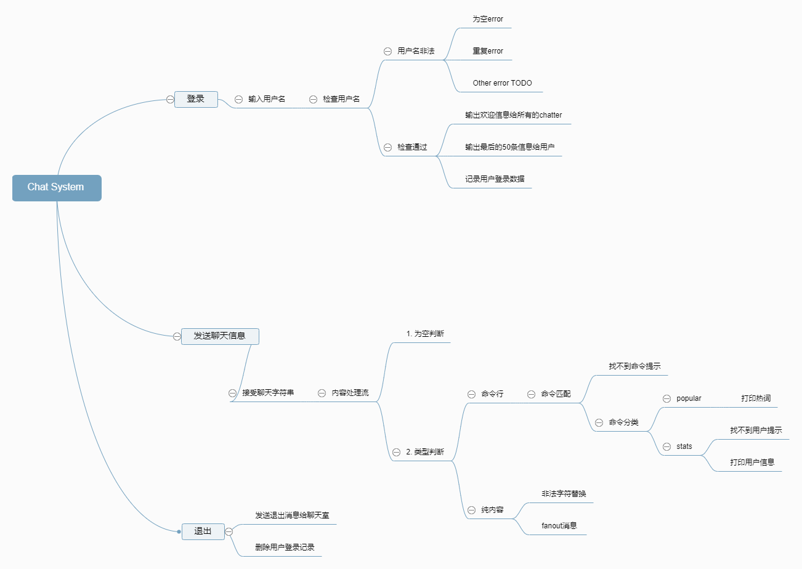

run `node index.js` in terminal to run the chat client


##nmp package add
1. ttl-mem-cache
    ````
    This is a in memory time to live key/value cache with streaming support. Items are not pro-actively pruned out as they age but expires when they are too old when touched. In other words; this module does not use setTimeout() or simmilar methods internally.
    
    There is no restrictions on the values stored in the cache and there is no maximum limit of the amount of items in the cache. Whan that is said, the intention of this module is to act as a simple key/value cache where one need to cache small to medium amounts of data.
    ````
2. readline
    ````
    Simple streaming readline module for NodeJS. Reads a file and buffers new lines emitting a line event for each line.
    ````
 3. mocha
    ````
    A framework for testing
    ````
    
 4. nyc
    ````
    A framework for testing corver
    ````
##思维导图
